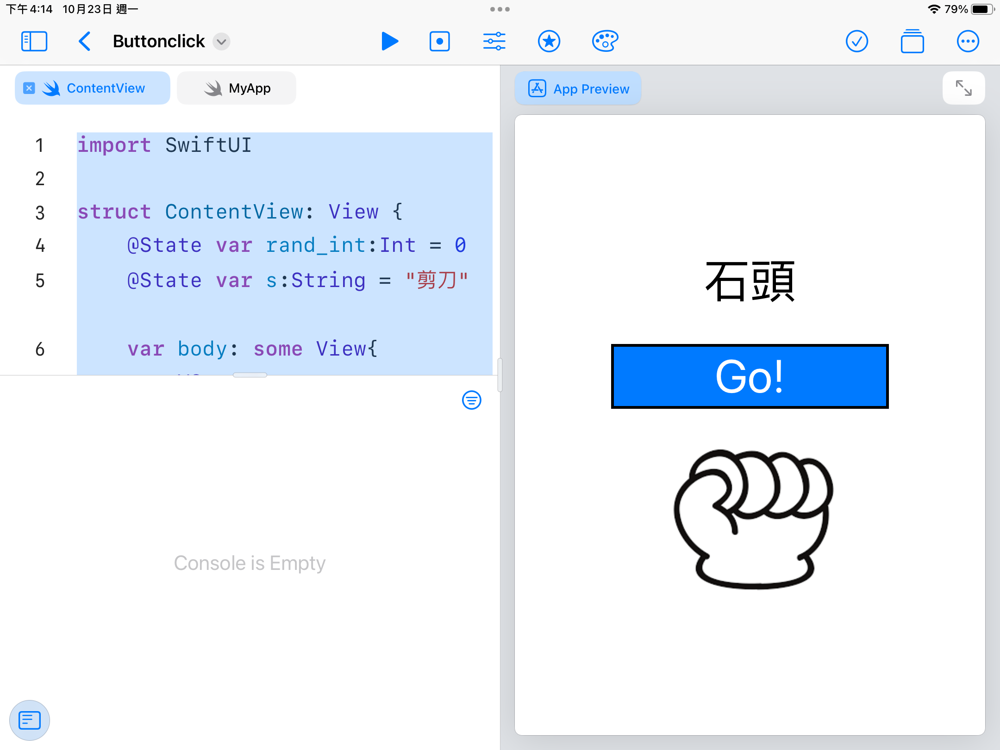

<h1>HW2</h1>
    
```swift
import SwiftUI

struct ContentView: View {
    @State var rand_int:Int = 0
    @State var s:String = "剪刀"     
    var body: some View{
        VStack{
            Text(s)
                .padding(.all,10)
                .frame(width: 150, height: 120, alignment: /*@START_MENU_TOKEN@*/.center/*@END_MENU_TOKEN@*/)
                .font(.system(size:50))
            Button(action: {
                rand_int=Int.random(in:0...2)
                if rand_int==0{
                    s = "剪刀"
                }
                else if rand_int==1{
                    s = "石頭"
                }
                else if rand_int==2{
                    s = "布"
                }
            }, label: {
                Text("Go!")
                    .frame(width: 300, height: 70, alignment: /*@START_MENU_TOKEN@*/.center/*@END_MENU_TOKEN@*/)
                    .font(.system(size : 50))
                    .background(Color.blue)
                    .foregroundColor(.white)
                    .border(/*@START_MENU_TOKEN@*/Color.black/*@END_MENU_TOKEN@*/, width: 3)
                
            }
            )
            Image(s)
        }
        
    }
}


    
```



https://www.youtube.com/watch?v=eGJ6S09a1PI
