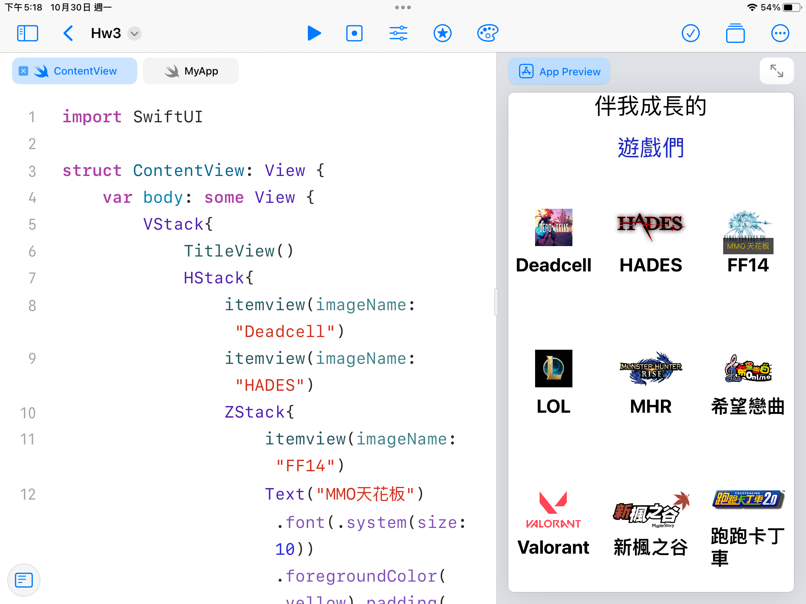

<h1>HW3</h1>
    
```swift
import SwiftUI

struct ContentView: View {
    var body: some View {
        VStack{
            TitleView()
            HStack{
                itemview(imageName: "Deadcell")
                itemview(imageName: "HADES")
                ZStack{
                    itemview(imageName: "FF14") 
                    Text("MMO天花板").font(.system(size: 10)).foregroundColor(.yellow).padding(.all,5).background(Color.black).opacity(0.7).offset(x:0,y:5)
                }
                         
            }
            HStack{
                itemview(imageName: "LOL")
                itemview(imageName: "MHR")            
                itemview(imageName: "希望戀曲")            
            }        
            HStack{
                itemview(imageName: "Valorant")
                itemview(imageName: "新楓之谷")            
                itemview(imageName: "跑跑卡丁車")            
            }        
            
        }
    }
}

struct TitleView: View{
    var body: some View {
        VStack(alignment: /*@START_MENU_TOKEN@*/.center/*@END_MENU_TOKEN@*/, spacing:20){
            Text("伴我成長的").font(.system(size:30))
            Text("遊戲們")
                .font(.title)
                .foregroundColor(Color(red:29/255,green: 40/255,blue:192/255))
        }
    }
}
extension UIScreen{
    static let screenWidth = UIScreen.main.bounds.size.width
    static let screenHeight = UIScreen.main.bounds.size.height
    static let screenSize = UIScreen.main.bounds.size}
struct itemview: View{
    var imageName:String
    var body: some View{
        HStack{
            VStack{
                Image(imageName).resizable().aspectRatio(contentMode: /*@START_MENU_TOKEN@*/.fill/*@END_MENU_TOKEN@*/).frame(width:50,height: 50, alignment: /*@START_MENU_TOKEN@*/.center/*@END_MENU_TOKEN@*/)
                Text(imageName).fontWeight(/*@START_MENU_TOKEN@*/.bold/*@END_MENU_TOKEN@*/).font(.system(size:25))
            } .frame(minWidth: /*@START_MENU_TOKEN@*/0/*@END_MENU_TOKEN@*/, idealWidth: /*@START_MENU_TOKEN@*/100/*@END_MENU_TOKEN@*/, maxWidth: /*@START_MENU_TOKEN@*/.infinity/*@END_MENU_TOKEN@*/, minHeight: /*@START_MENU_TOKEN@*/0/*@END_MENU_TOKEN@*/, idealHeight: /*@START_MENU_TOKEN@*/100/*@END_MENU_TOKEN@*/, maxHeight: /*@START_MENU_TOKEN@*/.infinity/*@END_MENU_TOKEN@*/, alignment: /*@START_MENU_TOKEN@*/.center/*@END_MENU_TOKEN@*/)
            
            
                        
        }
       
    }
    
}


    
```





